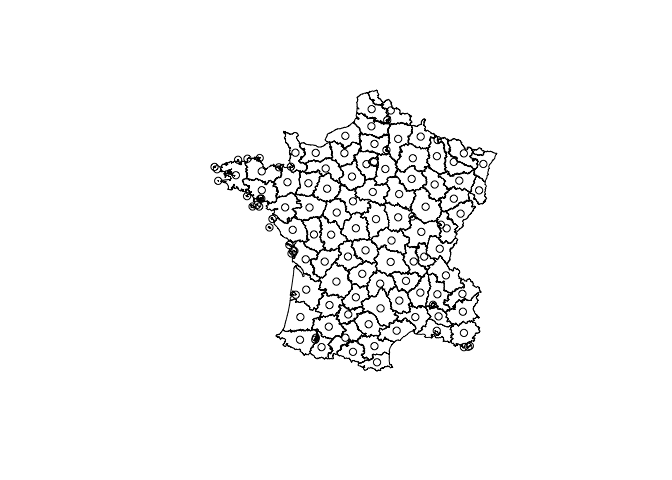
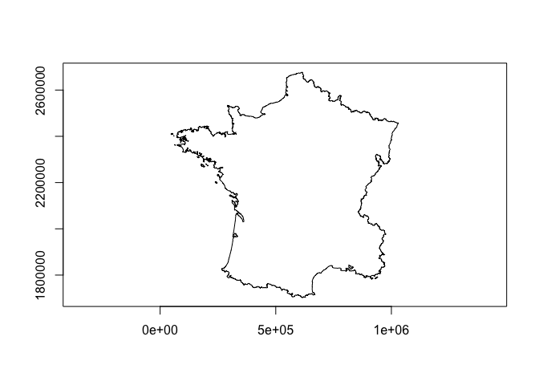
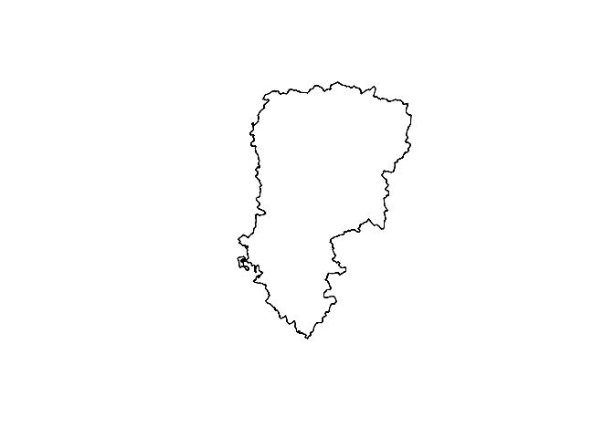
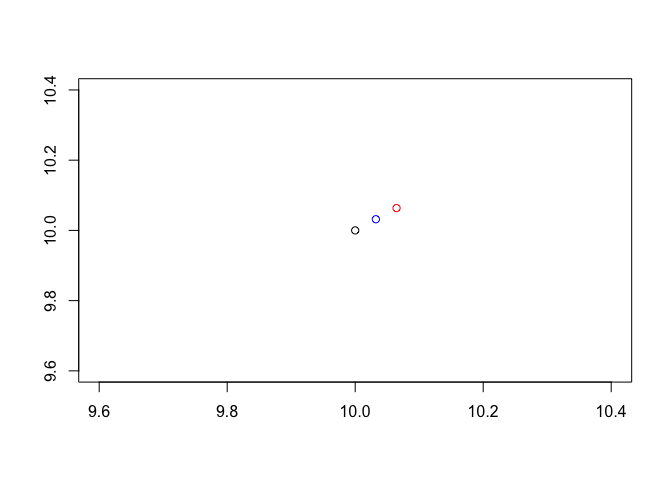
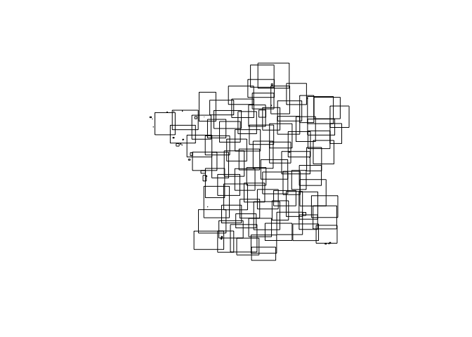
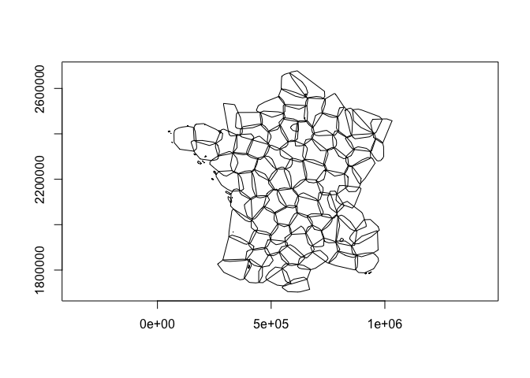

<!-- README.md is generated from README.Rmd. Please edit that file -->

# rsgeo

`rsgeo` is an interface to the Rust libraries `geo-types` and `geo`.
`geo-types` implements pure rust geometry primitives. The `geo` library
adds additional algorithm functionalities on top of `geo-types`. This
package lets you harness the speed, safety, and memory efficiency of
these libraries. `geo-types` does not support Z or M dimensions. There
is no support for CRS at this moment.

``` r
# install.packages(
#   'rsgeo', 
#   repos = c('https://josiahparry.r-universe.dev', 'https://cloud.r-project.org')
# )
library(rsgeo)
```

rsgeo works with vectors of geometries. When we compare this to `sf`
this is always the geometry column which is a class `sfc` object (simple
feature column).

``` r
# get geometry from sf
data(guerry, package = "sfdep")

polys <- guerry[["geometry"]] |>
  sf::st_cast("POLYGON")

# cast to rust geo-types
rs_polys <- as_rsgeo(polys)

head(rs_polys)
#> <rs_POLYGON[6]>
#> [1] Polygon { exterior: LineString([Coord { x: 801150.0, y: 2092615.0 }, Coord...
#> [2] Polygon { exterior: LineString([Coord { x: 729326.0, y: 2521619.0 }, Coord...
#> [3] Polygon { exterior: LineString([Coord { x: 710830.0, y: 2137350.0 }, Coord...
#> [4] Polygon { exterior: LineString([Coord { x: 882701.0, y: 1920024.0 }, Coord...
#> [5] Polygon { exterior: LineString([Coord { x: 886504.0, y: 1922890.0 }, Coord...
#> [6] Polygon { exterior: LineString([Coord { x: 747008.0, y: 1925789.0 }, Coord...
```

Cast geometries to sf

``` r
sf::st_as_sfc(rs_polys)
#> Geometry set for 116 features 
#> Geometry type: POLYGON
#> Dimension:     XY
#> Bounding box:  xmin: 47680 ymin: 1703258 xmax: 1031401 ymax: 2677441
#> CRS:           NA
#> First 5 geometries:
#> POLYGON ((801150 2092615, 800669 2093190, 80068...
#> POLYGON ((729326 2521619, 729320 2521230, 72928...
#> POLYGON ((710830 2137350, 711746 2136617, 71243...
#> POLYGON ((882701 1920024, 882408 1920733, 88177...
#> POLYGON ((886504 1922890, 885733 1922978, 88547...
```

Calculate the unsigned area of polygons.

``` r
bench::mark(
  rust = unsigned_area(rs_polys),
  sf = sf::st_area(polys),
  check = FALSE
)
#> # A tibble: 2 × 6
#>   expression      min   median `itr/sec` mem_alloc `gc/sec`
#>   <bch:expr> <bch:tm> <bch:tm>     <dbl> <bch:byt>    <dbl>
#> 1 rust        53.96µs   55.8µs    17616.     3.8KB      0  
#> 2 sf           1.34ms    1.4ms      709.   786.9KB     10.7
```

Find centroids

``` r
bench::mark(
  centroids(rs_polys),
  sf::st_centroid(polys),
  check = FALSE
)
#> # A tibble: 2 × 6
#>   expression                  min   median `itr/sec` mem_alloc `gc/sec`
#>   <bch:expr>             <bch:tm> <bch:tm>     <dbl> <bch:byt>    <dbl>
#> 1 centroids(rs_polys)    162.61µs 203.24µs     4166.     3.8KB    14.6 
#> 2 sf::st_centroid(polys)   2.34ms   2.46ms      404.   892.9KB     6.70
```

Extract points coordinates

``` r
coords(rs_polys) |> 
  head()
#>        x       y line_id polygon_id
#> 1 801150 2092615       1          1
#> 2 800669 2093190       1          1
#> 3 800688 2095430       1          1
#> 4 800780 2095795       1          1
#> 5 800589 2096112       1          1
#> 6 800333 2097190       1          1
```

Plot the polygons and their centroids

``` r
plot(rs_polys)
plot(centroids(rs_polys), add = TRUE)
```



Calculate a distance matrix. Note that there is often floating point
error differences so `check = FALSE` in this case.

``` r
pnts <- centroids(rs_polys)
pnts_sf <- sf::st_as_sfc(pnts)

bench::mark(
  rust = distance_euclidean_matrix(pnts, pnts),
  sf = sf::st_distance(pnts_sf, pnts_sf),
  check = FALSE
)
#> # A tibble: 2 × 6
#>   expression      min   median `itr/sec` mem_alloc `gc/sec`
#>   <bch:expr> <bch:tm> <bch:tm>     <dbl> <bch:byt>    <dbl>
#> 1 rust          305µs 429.43µs     2266.     108KB     6.15
#> 2 sf            3.4ms   3.56ms      280.     351KB     2.03
```

Simplify geometries.

``` r
x <- rs_polys
x_simple <- simplify_geoms(x, 5000)

plot(x_simple)
```


``` r
bench::mark(
  rust = simplify_geoms(rs_polys, 500),
  sf = sf::st_simplify(polys, FALSE, 500),
  check = FALSE
)
#> # A tibble: 2 × 6
#>   expression      min   median `itr/sec` mem_alloc `gc/sec`
#>   <bch:expr> <bch:tm> <bch:tm>     <dbl> <bch:byt>    <dbl>
#> 1 rust         5.95ms   6.23ms      161.    1.91KB     2.04
#> 2 sf           7.94ms   8.29ms      121.    1.24MB     4.17
```

Union geometries with `union_geoms()`. Some things sf is better at! One
of which is performing unary unions of complex geometries.

``` r
plot(union_geoms(rs_polys))
```



``` r

bench::mark(
  union_geoms(rs_polys),
  sf::st_union(polys),
  check = FALSE
)
#> # A tibble: 2 × 6
#>   expression                 min   median `itr/sec` mem_alloc `gc/sec`
#>   <bch:expr>            <bch:tm> <bch:tm>     <dbl> <bch:byt>    <dbl>
#> 1 union_geoms(rs_polys)    195ms    198ms      5.01        0B        0
#> 2 sf::st_union(polys)      111ms    113ms      8.91     921KB        0
```

We can cast between geometries as well.

``` r
lns <- cast_geoms(rs_polys, "linestring")
```

Some unions are faster when using rsgeo vectors like linestrings.

``` r
lns_sf <- sf::st_cast(polys, "LINESTRING")

bench::mark(
  union_geoms(lns),
  sf::st_union(lns_sf),
  check = FALSE
)
#> # A tibble: 2 × 6
#>   expression                min   median `itr/sec` mem_alloc `gc/sec`
#>   <bch:expr>           <bch:tm> <bch:tm>     <dbl> <bch:byt>    <dbl>
#> 1 union_geoms(lns)      119.7µs  175.2µs    5015.         0B     0   
#> 2 sf::st_union(lns_sf)   83.5ms   84.5ms      11.8    2.46MB     2.95
```

Find the closest point to a geometry

``` r
close_pnt <- closest_point(
  rs_polys, 
  geom_point(800000, 2090000)
)

plot(rs_polys[1])
plot(close_pnt, pch = 15, add = TRUE)
```



Find the haversine destination of a point, bearing, and distance.
Compare to the very fast geosphere destination point function.

``` r
bench::mark(
  rust = haversine_destination(geom_point(10, 10), 45, 10000),
  Cpp = geosphere::destPoint(c(10, 10), 45, 10000),
  check = FALSE
)
#> # A tibble: 2 × 6
#>   expression      min   median `itr/sec` mem_alloc `gc/sec`
#>   <bch:expr> <bch:tm> <bch:tm>     <dbl> <bch:byt>    <dbl>
#> 1 rust         5.33µs   6.36µs   145500.     3.2KB     14.6
#> 2 Cpp         15.87µs   17.1µs    50544.    11.8MB     30.3
```

``` r
origin <- geom_point(10, 10)

destination <- haversine_destination(origin, 45, 10000)

plot(c(origin, destination), col = c("red", "blue"))
```


Find intermediate point on a great circle.

``` r
middle <- haversine_intermediate(origin, destination, 1/2)

plot(origin)
plot(destination, add = TRUE, col = "red")
plot(middle, add = TRUE, col = "blue")
```



<!-- Utilize the chaikin smoothing algorithm with 5 iterations. -->
<!-- ```{r} -->
<!-- region <- rs_polys[[2]] -->
<!-- plot(chaikin_smoothing(region, 5)) -->
<!-- ``` -->

Find extreme coordinates with `extreme_coords()`

``` r
france <- union_geoms(rs_polys)

plot(france)
plot(extreme_coords(france)[[1]], add = TRUE, pch = 15)
```



Get bounding rectangles

``` r
rects <- bounding_rect(rs_polys)
plot(rects)
```


Convex hulls

``` r
convex_hull(rs_polys) |> 
  plot()
```



Expand into constituent geometries as a list of geometry vectors

``` r
expand_geoms(rs_polys) |> 
  head()
#> [[1]]
#> <rs_LINESTRING[1]>
#> [1] LineString([Coord { x: 801150.0, y: 2092615.0 }, Coord { x: 800669.0, y: 2...
#> 
#> [[2]]
#> <rs_LINESTRING[2]>
#> [1] LineString([Coord { x: 729326.0, y: 2521619.0 }, Coord { x: 729320.0, y: 2...
#> [2] LineString([Coord { x: 647667.0, y: 2468296.0 }, Coord { x: 647777.0, y: 2...
#> 
#> [[3]]
#> <rs_LINESTRING[1]>
#> [1] LineString([Coord { x: 710830.0, y: 2137350.0 }, Coord { x: 711746.0, y: 2...
#> 
#> [[4]]
#> <rs_LINESTRING[1]>
#> [1] LineString([Coord { x: 882701.0, y: 1920024.0 }, Coord { x: 882408.0, y: 1...
#> 
#> [[5]]
#> <rs_LINESTRING[1]>
#> [1] LineString([Coord { x: 886504.0, y: 1922890.0 }, Coord { x: 885733.0, y: 1...
#> 
#> [[6]]
#> <rs_LINESTRING[1]>
#> [1] LineString([Coord { x: 747008.0, y: 1925789.0 }, Coord { x: 746630.0, y: 1...
```

We can flatten the resultant geometries into a single vector using
`flatten_geoms()`

``` r
expand_geoms(rs_polys) |> 
  flatten_geoms() |> 
  head()
#> <rs_LINESTRING[6]>
#> [1] LineString([Coord { x: 801150.0, y: 2092615.0 }, Coord { x: 800669.0, y: 2...
#> [2] LineString([Coord { x: 729326.0, y: 2521619.0 }, Coord { x: 729320.0, y: 2...
#> [3] LineString([Coord { x: 647667.0, y: 2468296.0 }, Coord { x: 647777.0, y: 2...
#> [4] LineString([Coord { x: 710830.0, y: 2137350.0 }, Coord { x: 711746.0, y: 2...
#> [5] LineString([Coord { x: 882701.0, y: 1920024.0 }, Coord { x: 882408.0, y: 1...
#> [6] LineString([Coord { x: 886504.0, y: 1922890.0 }, Coord { x: 885733.0, y: 1...
```

Combine geometries into a single multi- geometry

``` r
combine_geoms(lns)
#> <rs_LINESTRING[1]>
#> [1] MultiLineString([LineString([Coord { x: 801150.0, y: 2092615.0 }, Coord { ...
```

Spatial predicates

``` r
x <- rs_polys[1:5]
intersects_sparse(x, rs_polys)
#> [[1]]
#> [1]  1 48 50 92 94
#> 
#> [[2]]
#> [1]   2   7  63  78  80  81  98 101
#> 
#> [[3]]
#> [1]  3 20 27 53 77 84 94
#> 
#> [[4]]
#> [1]   4   5  30 107 109
#> 
#> [[5]]
#> [1]  4  5 30 48
```

<!-- Convert to and from wkb and wkt -->
<!-- ```{r} -->
<!-- wkt <- wkt_from_geoms(x) -->
<!-- wkt_to_geoms(wkt) -->
<!-- ``` -->
<!-- ```{r} -->
<!-- wkb <- wkb_from_geoms(x) -->
<!-- head(wkb[[1]]) -->
<!-- wkb_to_geoms(wkb) -->
<!-- ``` -->

#### Notes

Right now plotting is done using `wk` by first casting the rsgeo into an
sfc object.
