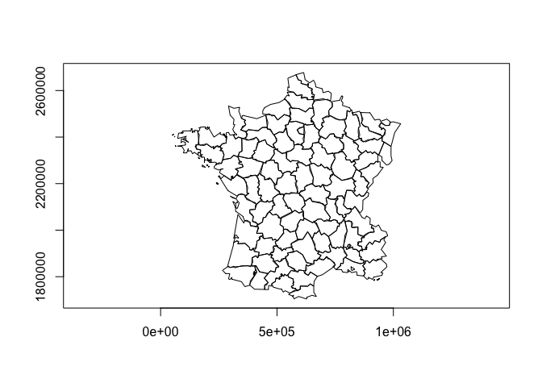
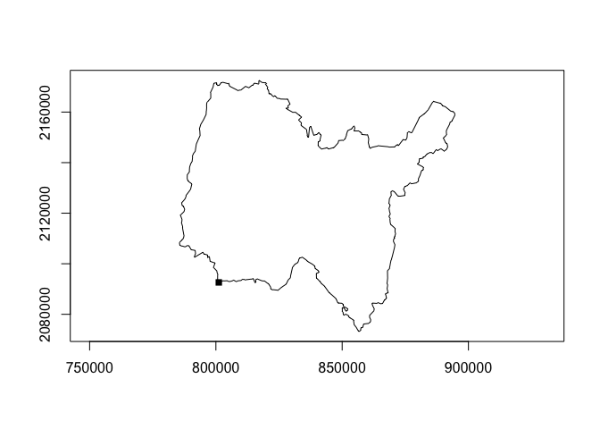
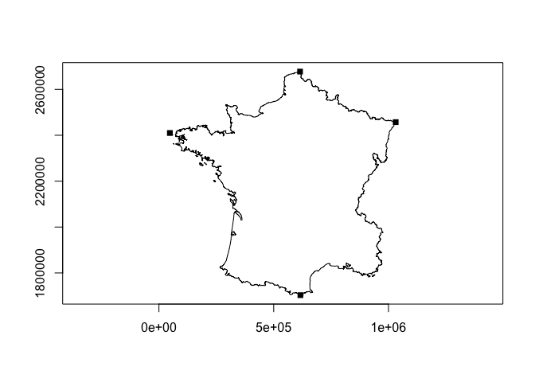
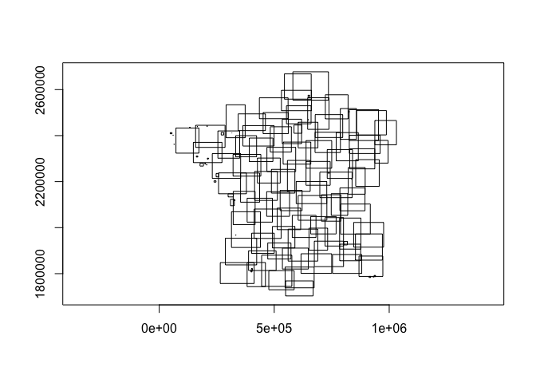

<!-- README.md is generated from README.Rmd. Please edit that file -->

# rsgeo

`rsgeo` is an interface to the Rust libraries `geo-types` and `geo`.
`geo-types` implements pure rust geometry primitives. The `geo` library
adds additional algorithm functionalities on top of `geo-types`. This
package lets you harness the speed, safety, and memory efficiency of
these libraries. `geo-types` does not support Z or M dimensions. There
is no support for CRS at this moment.

``` r
# remotes::install_github("josiahparry/rsgeo")
library(rsgeo)
#> 
#> Attaching package: 'rsgeo'
#> The following object is masked from 'package:base':
#> 
#>     within
```

Create geometries from sf objects

``` r
# get geometry from sf
data(guerry, package = "sfdep")

polys <- guerry[["geometry"]] |>
  sf::st_cast("POLYGON")

# cast to rust geo-types
rs_polys <- as_rsgeom(polys)

head(rs_polys)
#> <rs_POLYGON[6]>
#> [1] (Polygon { exterior: LineString([Coord { x: 801150.0, y: 2092615.0 }, Coor...
#> [2] (Polygon { exterior: LineString([Coord { x: 729326.0, y: 2521619.0 }, Coor...
#> [3] (Polygon { exterior: LineString([Coord { x: 710830.0, y: 2137350.0 }, Coor...
#> [4] (Polygon { exterior: LineString([Coord { x: 882701.0, y: 1920024.0 }, Coor...
#> [5] (Polygon { exterior: LineString([Coord { x: 886504.0, y: 1922890.0 }, Coor...
#> [6] (Polygon { exterior: LineString([Coord { x: 747008.0, y: 1925789.0 }, Coor...
```

Cast geometries to sf

``` r
sf::st_as_sfc(rs_polys)
#> Geometry set for 116 features 
#> Geometry type: POLYGON
#> Dimension:     XY
#> Bounding box:  xmin: 47680 ymin: 1703258 xmax: 1031401 ymax: 2677441
#> CRS:           NA
#> First 5 geometries:
#> POLYGON ((801150 2092615, 800669 2093190, 80068...
#> POLYGON ((729326 2521619, 729320 2521230, 72928...
#> POLYGON ((710830 2137350, 711746 2136617, 71243...
#> POLYGON ((882701 1920024, 882408 1920733, 88177...
#> POLYGON ((886504 1922890, 885733 1922978, 88547...
```

Calculate the unsigned area of polygons.

``` r
bench::mark(
  rust = unsigned_area(rs_polys),
  sf = sf::st_area(polys),
  check = FALSE
)
#> # A tibble: 2 × 6
#>   expression      min   median `itr/sec` mem_alloc `gc/sec`
#>   <bch:expr> <bch:tm> <bch:tm>     <dbl> <bch:byt>    <dbl>
#> 1 rust        83.27µs   87.7µs    11213.    3.82KB      0  
#> 2 sf           1.31ms   1.38ms      721.  745.35KB     10.6
```

Find centroids

``` r
bench::mark(
  centroids(rs_polys),
  sf::st_centroid(polys),
  check = FALSE
)
#> # A tibble: 2 × 6
#>   expression                  min   median `itr/sec` mem_alloc `gc/sec`
#>   <bch:expr>             <bch:tm> <bch:tm>     <dbl> <bch:byt>    <dbl>
#> 1 centroids(rs_polys)     200.6µs 245.71µs     3741.    3.82KB    15.1 
#> 2 sf::st_centroid(polys)    2.4ms   2.49ms      396.  756.52KB     6.38
```

Extract points as matrix

``` r
rs_polys |> 
  centroids() |> 
  as.matrix() |> 
  head()
#>          [,1]    [,2]
#> [1,] 832852.3 2126601
#> [2,] 688485.6 2507622
#> [3,] 665510.1 2155203
#> [4,] 912995.8 1908303
#> [5,] 911433.9 1970312
#> [6,] 765421.3 1974521
```

Plot the polygons and their centroids

``` r
plot(rs_polys)
plot(centroids(rs_polys), add = TRUE)
```


Calculate a distance matrix

``` r
pnts <- centroids(rs_polys)
pnts_sf <- sf::st_as_sfc(pnts)

bench::mark(
  rust = euclidean_distance_matrix(pnts, pnts),
  sf = sf::st_distance(pnts_sf, pnts_sf)
)
#> # A tibble: 2 × 6
#>   expression      min   median `itr/sec` mem_alloc `gc/sec`
#>   <bch:expr> <bch:tm> <bch:tm>     <dbl> <bch:byt>    <dbl>
#> 1 rust       165.48µs 181.63µs     5464.     108KB    12.6 
#> 2 sf           2.83ms   2.88ms      344.     352KB     2.02
```

Simplify a geometry

``` r
x <- rs_polys[[37]]
x_simple <- simplify_geom(x, 5000)

plot(x)
plot(x_simple, add = TRUE)
```



``` r
bench::mark(
  rust = simplify_geoms(rs_polys, 500),
  sf = sf::st_simplify(polys, FALSE, 500),
  check = FALSE
)
#> # A tibble: 2 × 6
#>   expression      min   median `itr/sec` mem_alloc `gc/sec`
#>   <bch:expr> <bch:tm> <bch:tm>     <dbl> <bch:byt>    <dbl>
#> 1 rust         3.61ms   3.82ms      262.       4KB     0   
#> 2 sf           7.75ms   8.05ms      124.    1.23MB     2.07
```

Union geometries with `union_geoms()`

``` r
plot(union_geoms(rs_polys))
```


Find the closest point to a geometry

``` r
close_pnt <- closest_point(
  rs_polys[[1]], 
  geom_point(800000, 2090000)
)

plot(rs_polys[[1]])
plot(close_pnt, pch = 15, add = TRUE)
```


Find the haversine destination of a point, bearing, and distance.

``` r
bench::mark(
  rust = haversine_destination(geom_point(10, 10), 45, 10000),
  Cpp = geosphere::destPoint(c(10, 10), 45, 10000),
  check = FALSE
)
#> # A tibble: 2 × 6
#>   expression      min   median `itr/sec` mem_alloc `gc/sec`
#>   <bch:expr> <bch:tm> <bch:tm>     <dbl> <bch:byt>    <dbl>
#> 1 rust         2.34µs   3.03µs   307755.    3.23KB      0  
#> 2 Cpp         15.66µs  17.38µs    51943.   11.45MB     46.8
```

``` r
origin <- geom_point(10, 10)

destination <- haversine_destination(origin, 45, 10000)

plot(origin)
plot(destination, col = "blue", add = TRUE)
```



Find intermediate point.

``` r
middle <- haversine_intermediate(origin, destination, 1/2)

plot(origin)
plot(destination, add = TRUE, col = "red")
plot(middle, add = TRUE, col = "blue")
```


Utilize the chaikin smoothing algorithm with 5 iterations.

``` r
region <- rs_polys[[2]]
plot(chaikin_smoothing(region, 5))
```


Find extreme coordinates with `extreme_coords()`

``` r
france <- union_geoms(rs_polys)


plot(france)
plot(extreme_coords(france[[1]]), add = TRUE, pch = 15)
```


Get bounding rectangles

``` r
rects <- bounding_rectangles(rs_polys)
plot(rects)
```



Convext hulls

``` r
convex_hulls(rs_polys) |> 
  plot()
```



Cast geometries

``` r
lns <- cast_geoms(rs_polys, "linestring")
head(lns)
#> <rs_LINESTRING[6]>
#> [1] (LineString([Coord { x: 801150.0, y: 2092615.0 }, Coord { x: 800669.0, y: ...
#> [2] (LineString([Coord { x: 729326.0, y: 2521619.0 }, Coord { x: 729320.0, y: ...
#> [3] (LineString([Coord { x: 710830.0, y: 2137350.0 }, Coord { x: 711746.0, y: ...
#> [4] (LineString([Coord { x: 882701.0, y: 1920024.0 }, Coord { x: 882408.0, y: ...
#> [5] (LineString([Coord { x: 886504.0, y: 1922890.0 }, Coord { x: 885733.0, y: ...
#> [6] (LineString([Coord { x: 747008.0, y: 1925789.0 }, Coord { x: 746630.0, y: ...
```

Expand into constituent geometries.

``` r
expand_geoms(rs_polys, flat = TRUE) |> 
  head()
#> <rs_LINESTRING[6]>
#> [1] (LineString([Coord { x: 801150.0, y: 2092615.0 }, Coord { x: 800669.0, y: ...
#> [2] (LineString([Coord { x: 729326.0, y: 2521619.0 }, Coord { x: 729320.0, y: ...
#> [3] (LineString([Coord { x: 647667.0, y: 2468296.0 }, Coord { x: 647777.0, y: ...
#> [4] (LineString([Coord { x: 710830.0, y: 2137350.0 }, Coord { x: 711746.0, y: ...
#> [5] (LineString([Coord { x: 882701.0, y: 1920024.0 }, Coord { x: 882408.0, y: ...
#> [6] (LineString([Coord { x: 886504.0, y: 1922890.0 }, Coord { x: 885733.0, y: ...
```

Combine geometries into a single geometry

``` r
combine_geoms(lns)
#> <rs_MULTILINESTRING[1]>
#> [1] (MultiLineString([LineString([Coord { x: 801150.0, y: 2092615.0 }, Coord {...
```

Union geometries

``` r
plot(union_geoms(rs_polys))
```


Spatial predicates

``` r
x <- rs_polys[1:5]
intersects_sparse(x, rs_polys)
#> [[1]]
#> [1] 94 50  1 92 48
#> 
#> [[2]]
#> [1]  63   2   7  80  98  78  81 101
#> 
#> [[3]]
#> [1] 77 84  3 20 94 27 53
#> 
#> [[4]]
#> [1]   4   5  30 109 107
#> 
#> [[5]]
#> [1]  4  5 48 30
```

Convert to and from wkb and wkt

``` r
wkt <- wkt_from_geoms(x)
wkt_to_geoms(wkt)
#> <rs_POLYGON[5]>
#> [1] (Polygon { exterior: LineString([Coord { x: 801150.0, y: 2092615.0 }, Coor...
#> [2] (Polygon { exterior: LineString([Coord { x: 729326.0, y: 2521619.0 }, Coor...
#> [3] (Polygon { exterior: LineString([Coord { x: 710830.0, y: 2137350.0 }, Coor...
#> [4] (Polygon { exterior: LineString([Coord { x: 882701.0, y: 1920024.0 }, Coor...
#> [5] (Polygon { exterior: LineString([Coord { x: 886504.0, y: 1922890.0 }, Coor...
```

``` r
wkb <- wkb_from_geoms(x)
head(wkb[[1]])
#> [1] 01 03 00 00 00 01

wkb_to_geoms(wkb)
#> <rs_POLYGON[5]>
#> [1] (Polygon { exterior: LineString([Coord { x: 801150.0, y: 2092615.0 }, Coor...
#> [2] (Polygon { exterior: LineString([Coord { x: 729326.0, y: 2521619.0 }, Coor...
#> [3] (Polygon { exterior: LineString([Coord { x: 710830.0, y: 2137350.0 }, Coor...
#> [4] (Polygon { exterior: LineString([Coord { x: 882701.0, y: 1920024.0 }, Coor...
#> [5] (Polygon { exterior: LineString([Coord { x: 886504.0, y: 1922890.0 }, Coor...
```

#### Notes

Right now plotting is done using `sf` by first casting into R native
objects and then assigned the appropriate sf class. That object is then
plotted by sf
