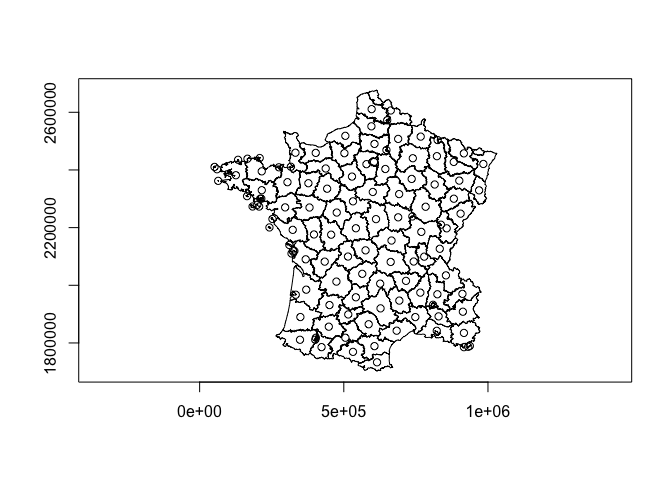
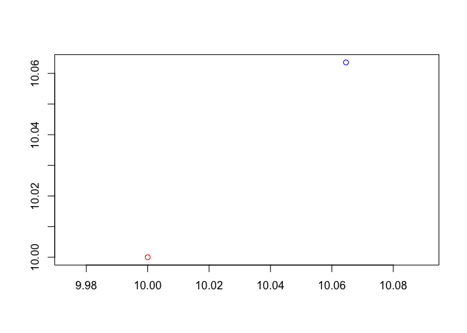

<!-- README.md is generated from README.Rmd. Please edit that file -->

# rsgeo

`rsgeo` is an interface to the Rust libraries `geo-types` and `geo`.
`geo-types` implements pure rust geometry primitives. The `geo` library
adds additional algorithm functionalities on top of `geo-types`. This
package lets you harness the speed, safety, and memory efficiency of
these libraries. `geo-types` does not support Z or M dimensions. There
is no support for CRS at this moment.

``` r
# remotes::install_github("josiahparry/rsgeo")
library(rsgeo)
```

Create geometries from sf objects

``` r
# get geometry from sf
data(guerry, package = "sfdep")

polys <- guerry[["geometry"]] |>
  sf::st_cast("POLYGON")

# cast to rust geo-types
rs_polys <- as_rsgeom(polys)

head(rs_polys)
#> (Polygon { exterior: LineString([Coord { x: 801150.0, y: 2092615.0 }, Coor....
#> (Polygon { exterior: LineString([Coord { x: 729326.0, y: 2521619.0 }, Coor....
#> (Polygon { exterior: LineString([Coord { x: 710830.0, y: 2137350.0 }, Coor....
#> (Polygon { exterior: LineString([Coord { x: 882701.0, y: 1920024.0 }, Coor....
#> (Polygon { exterior: LineString([Coord { x: 886504.0, y: 1922890.0 }, Coor....
#> (Polygon { exterior: LineString([Coord { x: 747008.0, y: 1925789.0 }, Coor....
```

Cast geometries to sf

``` r
as_sf(rs_polys)
#> Geometry set for 116 features 
#> Geometry type: POLYGON
#> Dimension:     XY
#> Bounding box:  xmin: 47680 ymin: 1703258 xmax: 1031401 ymax: 2677441
#> CRS:           NA
#> First 5 geometries:
#> POLYGON ((801150 2092615, 800669 2093190, 80068...
#> POLYGON ((729326 2521619, 729320 2521230, 72928...
#> POLYGON ((710830 2137350, 711746 2136617, 71243...
#> POLYGON ((882701 1920024, 882408 1920733, 88177...
#> POLYGON ((886504 1922890, 885733 1922978, 88547...
```

Calculate the unsigned area of polygons.

``` r
bench::mark(
  rust = unsigned_area(rs_polys),
  sf = sf::st_area(polys),
  check = FALSE
)
#> # A tibble: 2 × 6
#>   expression      min   median `itr/sec` mem_alloc `gc/sec`
#>   <bch:expr> <bch:tm> <bch:tm>     <dbl> <bch:byt>    <dbl>
#> 1 rust        82.49µs 100.16µs     9759.    3.82KB     0   
#> 2 sf           1.32ms   1.48ms      678.  745.35KB     8.42
```

Find centroids

``` r
bench::mark(
  centroids(rs_polys),
  sf::st_centroid(polys),
  check = FALSE
)
#> # A tibble: 2 × 6
#>   expression                  min   median `itr/sec` mem_alloc `gc/sec`
#>   <bch:expr>             <bch:tm> <bch:tm>     <dbl> <bch:byt>    <dbl>
#> 1 centroids(rs_polys)    207.42µs    285µs     3261.    3.81KB    10.2 
#> 2 sf::st_centroid(polys)   2.44ms    2.6ms      381.  756.52KB     6.39
```

Extract points as matrix

``` r
rs_polys |> 
  centroids() |> 
  as.matrix() |> 
  head()
#>          [,1]    [,2]
#> [1,] 832852.3 2126601
#> [2,] 688485.6 2507622
#> [3,] 665510.1 2155203
#> [4,] 912995.8 1908303
#> [5,] 911433.9 1970312
#> [6,] 765421.3 1974521
```

Plot the polygons and their centroids

``` r
plot(rs_polys)
plot(centroids(rs_polys), add = TRUE)
```



Calculate a distance matrix

``` r
pnts <- centroids(rs_polys)
pnts_sf <- as_sf(pnts)

bench::mark(
  rust = euclidean_distance_matrix(pnts, pnts),
  sf = sf::st_distance(pnts_sf, pnts_sf)
)
#> # A tibble: 2 × 6
#>   expression      min   median `itr/sec` mem_alloc `gc/sec`
#>   <bch:expr> <bch:tm> <bch:tm>     <dbl> <bch:byt>    <dbl>
#> 1 rust        254.2µs 274.25µs     3599.     108KB     8.55
#> 2 sf           2.94ms   3.08ms      324.     352KB     2.03
```

Simplify a geometry

``` r
x <- rs_polys[[37]]
x_simple <- simplify_geom(x, 5000)

plot(x)
plot(x_simple, add = TRUE)
```


``` r
bench::mark(
  rust = simplify_geoms(rs_polys, 500),
  sf = sf::st_simplify(polys, FALSE, 500),
  check = FALSE
)
#> # A tibble: 2 × 6
#>   expression      min   median `itr/sec` mem_alloc `gc/sec`
#>   <bch:expr> <bch:tm> <bch:tm>     <dbl> <bch:byt>    <dbl>
#> 1 rust         5.44ms   5.58ms      179.       4KB     0   
#> 2 sf            8.1ms   8.49ms      118.    1.23MB     4.21
```

Union geometries with `union_geoms()`

``` r
plot(union_geoms(rs_polys))
```


Find the closest point to a geometry

``` r
close_pnt <- closest_point(
  rs_polys[[1]], 
  geom_point(800000, 2090000)
)

plot(rs_polys[[1]])
plot(close_pnt, pch = 15, add = TRUE)
```


Find the haversine destination of a point, bearing, and distance.

``` r
bench::mark(
  rust = haversine_destination(geom_point(10, 10), 45, 10000),
  Cpp = geosphere::destPoint(c(10, 10), 45, 10000),
  check = FALSE
)
#> # A tibble: 2 × 6
#>   expression      min   median `itr/sec` mem_alloc `gc/sec`
#>   <bch:expr> <bch:tm> <bch:tm>     <dbl> <bch:byt>    <dbl>
#> 1 rust         2.38µs   3.57µs   271097.    3.22KB      0  
#> 2 Cpp         16.44µs  17.79µs    51747.   11.45MB     31.1
```

``` r
origin <- geom_point(10, 10)

destination <- haversine_destination(origin, 45, 10000)

plot(origin)
plot(destination, col = "blue", add = TRUE)
```


Find intermediate point.

``` r
middle <- haversine_intermediate(origin, destination, 1/2)

plot(origin)
plot(destination, add = TRUE, col = "red")
plot(middle, add = TRUE, col = "blue")
```


Utilize the chaikin smoothing algorithm with 5 iterations.

``` r
region <- rs_polys[[2]]
plot(chaikin_smoothing(region, 5))
```



Find extreme coordinates with `extreme_coords()`

``` r
france <- union_geoms(rs_polys)


plot(france)
plot(extreme_coords(france), add = TRUE, pch = 15)
```


#### Notes

Right now plotting is done using `sf` by first casting into R native
objects and then assigned the appropriate sf class. That object is then
plotted by sf
